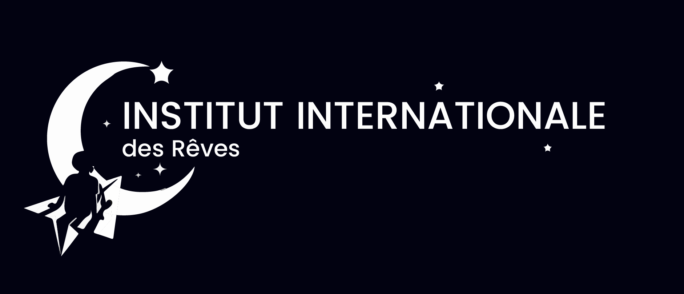

# TEAM SIRIUS -Webcup 2023-
<p align="center"></p>

# A PROPOS

Ce projet est créé par la Team Sirius de Madagascar pour la compétion WEBCUP 2023 manche régionale.
Ce projet présente l'Institut International des Rêves et le fruit du résultat de leur recherche: l'incroyable intelligence artificiel qui décode les rêves et prédire l'avenir en fonction des rêves; ONIRIX.

<p align="center">
    
    
</p>


# INSTALLATION

Voici comment installer le projet en local

- Clonner le repository:
```bash 
git clone https://github.com/Nomenyi/sirius_webcup.git
````

- Installer les packages
```bash
cd sirius_webcup
npm install
```

- Lancer le projet au serveur local
```bash
npm start
```

- Ouvrir un navigateur et entrer [http://localhost:3000](http://localhost:3000) pour le voir.

# EXTRAS
On a utilisé le fameux API CPT-3 de l'OpenAi pour simuler l'interaction avec l'utilisateur un chatbot qui est basé sur GPT-3.

Le nombre de requête envoyé est limité, donc il n'y aura plus de réponse automatique dans le chat si le quota journalier est epuisé.
